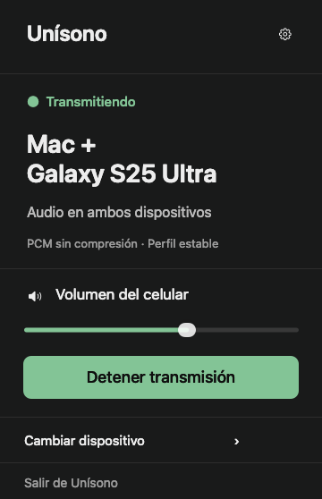
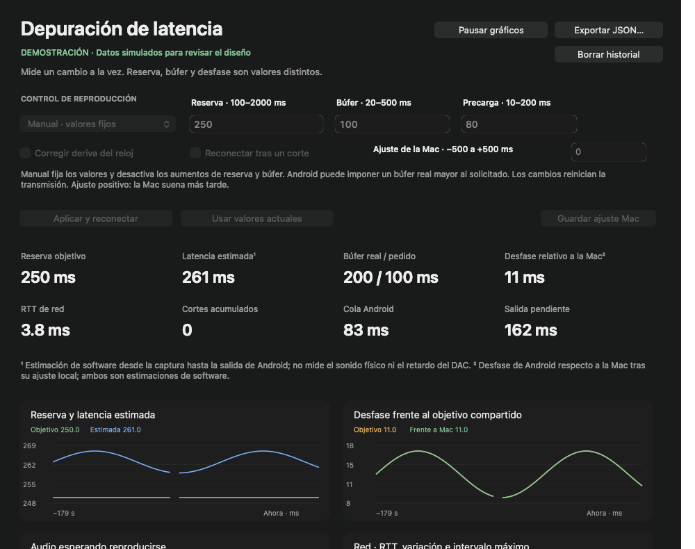

# Unísono


Stream your Mac's system audio to Android over your local network, and listen on both devices at once.

Unísono is a native macOS menu-bar app with a companion Android receiver. It offers adaptive AAC, FLAC compression of 24-bit PCM, and uncompressed Float32 PCM streaming. It encrypts the connection and lets you adjust the shared playback reserve to balance delay and continuity.

**Status: experimental personal-use prototype.** Version 0.3.0 adds latency debugging on Mac and Android. The validation section separates controls and telemetry checks from acoustic synchronization and long-running stability.

[Download a prerelease](https://github.com/AbrahamPanama/unisono/releases) · [Guía en español](LEEME.md) · [Wire protocol](PROTOCOL.md)

Version 0.3.0 adds **Depuración de latencia** in both apps: an explicit Auto/Manual mode, editable playback controls, live numerical measurements and charts, an event timeline, and local JSON export. Manual mode keeps the requested settings and codec fixed so that recovery does not silently change the experiment.

Version 0.2.4 added **Sin pérdida · FLAC 24 bits**, using native Mac encoding and Android decoding. Captured Float32 samples are first converted to signed 24-bit PCM; FLAC preserves those converted integers exactly. **Sin compresión · PCM Float32** remains available to preserve the original captured samples in transport. In Automatic mode, unavailable FLAC falls back to PCM and never switches to AAC during recovery. Manual mode stops with a visible error if the selected codec cannot be honored.

Version 0.2.3 added a custom shared reserve of 250–1000 ms in Mac settings, retaining the 500 ms default. It allowed balanced AAC and PCM to honor a 250 ms setting while stable AAC retained a 750 ms minimum. It also separated the Mac synchronization offset, rejected values outside ±100 ms instead of silently clamping them, and labeled Android's independent output buffer explicitly. FLAC uses the same reserve policy.

Version 0.2.2 introduced the approved mint U and sound-wave icon: a Mac app icon and native menu-bar template, plus Android adaptive, themed, and notification icons. That release kept the audio behavior of 0.2.1.



*Native UI preview of the connected state. The app lives in the macOS menu bar, not the Dock.*

## What it does

- Captures system audio with Core Audio Taps, excluding Unísono's own playback.
- Sends AAC-LC at a 256 or 160 kbps target, variable-bitrate FLAC of 24-bit PCM, or uncompressed stereo Float32 PCM, over encrypted TCP.
- Authenticates pairing with a random key and encrypts packets with AES-256-GCM.
- Plays locally on the Mac and remotely on Android, or only on Android.
- Offers the existing automatic 250–1000 ms reserve policy and a Manual debugging mode with a fixed 100–2000 ms reserve, requested output buffer, prefill, clock-correction and retry controls.
- Shows live timing, buffer, network, processing and capture metrics, up to ten minutes of charts, and a bounded event history on both devices.
- Imports a pairing link or QR through the Android camera's link handler.
- Supports phone-volume control and Android background playback with a foreground-service notification.
- Offers **Mezclar con otras apps**, enabled by default, to listen alongside another music app.
- Makes up to three connection attempts per start. Manual mode can disable retries or repeat the same settings; intentional stops do not automatically reconnect.

## Requirements

| Platform | Requirements |
|---|---|
| macOS | Apple Silicon, macOS 14.2+, system-audio capture permission |
| Android | Android 8.0 / API 26+, compatible stereo PCM output |
| Network | Both devices on a LAN that allows connections between them; TCP port 45871 |

The currently tested environments are a Mac mini M4 running macOS 26.6.1 and an Android 15 ARM64 emulator. The minimum platform versions are build targets, not a claim that every supported OS/device has been tested.

## Try it

1. Download `Unisono-Mac.zip` and `Unisono-Android.apk` from the [prereleases](https://github.com/AbrahamPanama/unisono/releases).
2. Extract and open the Mac app. Install the APK on Android using your device's normal sideloading flow.
3. Open Unísono's menu-bar icon, then the gear. Scan its QR with the phone camera, or copy the entire connection link into the Android app.
4. Tap **Conectar** on Android and grant the Mac's audio-capture permission when prompted. Play audio on the Mac. Reconnect once if the first permission prompt interrupted pairing.
5. Start with **Equilibrado · AAC adaptable** on Android. Choose **Más estable · AAC 160 kbps** for a larger starting reserve, **Sin pérdida · FLAC 24 bits** for compression after conversion to 24-bit PCM, or **Sin compresión · PCM Float32** to preserve the captured samples exactly in transport. Disconnect to change the mode.
6. Open **Depuración de latencia** on either device to observe the current session. Use **Manual** and **Usar valores actuales** to copy a baseline, then explicitly apply a change. The older Mac **Reserva de audio** setting still controls the automatic 250–1000 ms policy; its default is 500 ms, and stable AAC can request at least 750 ms.

The apps currently use a Spanish interface. Closing the Mac panel leaves streaming active. **Detener transmisión** ends the session and restores normal Mac playback; **Salir de Unísono** quits the app.

These are development builds: the Mac app is ad-hoc signed and not notarized for public distribution, and the Android APK uses a development signing identity. A locally rebuilt Android APK uses a different identity unless you preserve its generated keystore, so it cannot update an existing differently signed install directly.

## Latency debugging



*Interface illustration with clearly marked simulated data; these charts are not playback measurements.*

Open **Depuración de latencia** from the Mac app or from the button near Android's quality controls. Update both apps to use Manual mode. Mac can send settings to a connected, compatible Android receiver; Android can also save settings while disconnected for its next connection. Typing into a field only edits a draft. **Aplicar y reiniciar audio** applies validated settings and restarts the session so the new timing is shared by both devices.

| Control | Manual behavior |
|---|---|
| **Reserva de audio** | Integer **100–2000 ms**, used exactly as the shared reserve; automatic profile floors and recovery increases do not override it. |
| **Búfer de salida solicitado** | Integer **20–500 ms**, requested from AudioTrack and kept fixed. Android may impose a larger effective buffer; the two values are displayed separately. |
| **Precarga solicitada** | Integer **10–200 ms**, no greater than the requested buffer. The receiver fills this amount before starting; actual hardware behavior is reported separately. |
| **Corregir deriva del reloj** | Enable bounded playback-speed correction, or disable it to hold the playback speed at 1.0 while investigating clock drift. |
| **Reconectar después de un fallo** | Retry with the same manual reserve, requested buffer, prefill, codec and AAC bitrate. With retries disabled, a failure stops the session for inspection. |
| Mac synchronization adjustment | The Mac debugging window allows **−500 to +500 ms** locally. Positive values delay the Mac, negative values advance it. This is separate from Android's reserve/buffer controls; combinations that cannot schedule the local output safely are rejected. |

Manual mode never silently changes codec or lowers AAC bitrate. An unavailable codec or a Mac that does not confirm the complete manual configuration produces an error. Output underruns still appear in the counters/events; Manual does not automatically grow the requested buffer. Returning to **Automático** restores adaptive buffering, reserve recovery, codec fallback and clock correction. The ordinary Mac settings retain their narrower ±100 ms local adjustment; applying those settings clears the debugging-window override.

For an experiment, copy the values of a working session into Manual, apply them, and change one control at a time. Keep the same codec and output route when comparing runs. **Pausar vista** / **Pausar gráficos** freezes the displayed values and charts while audio and telemetry collection continue. Resume to catch up. Clearing history removes the stored samples and events without stopping audio.

The history stores up to ten minutes at approximately one sample per second. Missing or unavailable data appears as **—** and gaps in charts. The timing charts use per-second peaks for packet-arrival gaps, decoding and output writes, so a short stall is not hidden by a healthy last observation. Separate numerical values retain the latest observation. Jitter is a smoothed variation between audio-message arrival intervals and source timestamps over TCP; it is not a packet-loss measurement. Capture-to-arrival age includes encoding and transport. Decode timing includes waiting to enqueue decoded audio. Queued output is an estimate from written source samples and playback position.

| Measurement | Interpretation |
|---|---|
| `reserveMs` | The actual shared scheduling reserve. |
| `syncMs` | Android playback phase relative to the **shared reserve target**, excluding the Mac-only adjustment. Positive means later than that target. |
| `syncAgeMs` | Age of the last successful Android playback timestamp. A failed timestamp read or more than three seconds without a successful read makes the phase and derived latency estimates unavailable. |
| `estimatedLatencyMs` | `reserveMs + syncMs`: a software estimate from capture to Android playback timestamps, **not measured acoustic latency**. Do not add the output-buffer capacity again. |
| `macRelativeMs` | `syncMs − macTrimMs`: estimated Android timing relative to the Mac's planned local output. Available only with local Mac playback and recent Mac telemetry; it is not a speaker-to-speaker measurement. |
| Requested/effective buffer | The capacity requested from AudioTrack versus the value the device reports. Neither is the amount of audio currently queued or an independently measured extra delay. |
| Current/cumulative underruns | AudioTrack underruns for the current output versus a running total across retries. A retry can reset the current-output counter; the event log preserves the failure sequence. |

Additional metrics include RTT and clock offset, throughput and active AAC bitrate, Wi-Fi signal/link speed where available, app/output queues, reconnects, clock-correction speed, CPU and Java heap usage, and Mac capture/encoding/send/local-output measurements. RSSI alone cannot distinguish network, decoder, scheduling, clipping or output-device problems. CPU usage can exceed 100% across multiple cores; reported Wi-Fi link speed is not the measured audio throughput.

Receiver byte/rate counters include all received plaintext messages, including controls. Mac send rate includes encrypted frame overhead. Their values therefore describe different byte counts and need not match exactly.

**Exportar JSON** saves the selected local diagnostic history through the platform's file picker. It contains measurements, settings and bounded event descriptions; audio, pairing credentials, network addresses and device names are excluded or redacted. Exporting does not upload a report or record the stream. The Mac and Android exports use different documented JSON layouts; both identify unavailable measurements rather than substituting zero.

## Background playback and other music apps

Opening another app leaves the foreground audio service running. To listen to Unísono alongside Spotify or another music app, leave **Mezclar con otras apps** enabled in Android before connecting. Disconnect to change this setting. Uncheck it if you prefer Unísono to request audio focus and stop when another app takes over.

Mixing mode deliberately does not request audio focus; it keeps normal media/music audio attributes. Simply ignoring focus-loss callbacks after acquiring focus would still allow Android 12+ to fade the player. See [Android's audio-focus documentation](https://developer.android.com/media/optimize/audio-focus). The service also stops when Android reports call, ringtone, or communication mode; reconnect after the call. This check does not detect communication apps that fail to report their audio mode.

Background playback, both music-app start orders, and normal-mode focus loss are tested on an Android 15 emulator with an independent media player. The mixer reports both tracks active and unmuted in mixing mode. This does not verify acoustic output or guarantee Spotify/Samsung firmware behavior on the physical S25 Ultra. Device battery restrictions can also interrupt long background sessions.

## Connection stability on Galaxy S25 Ultra

Version 0.2.1 removes the automatic restart triggered solely by a large `AudioTimestamp` offset. On a physical S25 Ultra running Android 16, v0.2.0 restarted three times in 20 seconds despite zero output underruns. Fixed device/route latency is now diagnostic information, and bounded timing corrections continue without disconnecting for phase error alone. With the patch, the same physical phone remained connected for 60/60 observed seconds with zero disconnect transitions and zero reported underruns. This short test does not establish long-term stability or acoustic alignment.

For the v0.2.1 release, the Mac binary was unchanged from v0.2.0; that connection fix only required updating Android.

The Android service exposes bounded state via `adb shell dumpsys activity service app.unisono/.AudioService` without pairing keys or audio contents. Failed playback now reports its underlying reason instead of masking it as `Socket closed`.

## Quality modes and popping

The initial-reserve and automatic-recovery behavior in this section applies to **Automático**. **Manual** uses its explicit reserve and preserves codec/bitrate through retries; unavailable codecs stop the session instead of falling back.

| Android mode | Audio transport | Initial reserve |
|---|---|---|
| Equilibrado · AAC adaptable (default) | AAC-LC, 256 kbps target; 160 kbps on recovery | 500 ms default; configurable from 250 ms |
| Más estable · AAC 160 kbps | AAC-LC, 160 kbps target | At least 750 ms; follows a larger Mac setting |
| Sin pérdida · FLAC 24 bits | FLAC preserves the converted signed 24-bit PCM; PCM fallback, never AAC | 500 ms default; configurable from 250 ms |
| Sin compresión · PCM Float32 | Original captured Float32 PCM; never automatically switches to AAC | 500 ms default; configurable from 250 ms |

**AAC is lossy.** Its lower network usage is a deliberate quality/stability tradeoff. The Android status and Mac panel show the actual codec, bitrate target where applicable, and shared reserve. AAC uses native Mac encoding and Android decoding at 48 kHz, with encoder priming removed before scheduling playback. Unavailable AAC initialization falls back to PCM, which is reported in the status. Legacy receivers request PCM; legacy Mac builds respond with PCM. Update both apps to use all adaptation features.

FLAC retains the captured sample rate and sends 1024-frame blocks without encoder priming. At 48 kHz, each block represents about 21.3 ms of source audio. Its bitrate varies with the content; there is no fixed bitrate target or guaranteed compression ratio. It does not lower Android's output-buffer requirement. If native FLAC cannot initialize, decode correctly, or produce a supported output precision, the session uses PCM Float32 instead. An older Mac that does not recognize FLAC also responds with PCM. The Android status reports the actual transport and marks PCM as an alternative when FLAC was selected.

Android now fills approximately 100 ms of output audio before playback, coalesces small PCM packets, increases its output buffer after underruns toward 250 ms (subject to device limits), smooths startup/volume changes over 10 ms, and filters clock corrections instead of adjusting aggressively every half-second. Corrections change at most every two seconds, with a 3 ms deadband and a 200 ppm step limit.

After a failed session or repeated underruns, the receiver reconnects with 250 ms added to the actual negotiated reserve, capped at 1000 ms: a 250 ms session can recover at 500 ms, then 750 ms. The Mac uses the larger of its configured reserve and the receiver's request, so both restart on the same timeline. Balanced AAC, FLAC, and PCM initially request a 250 ms minimum; stable AAC requests 750 ms. This introduces a brief pause; it is not seamless bitrate switching. FLAC recovery retains FLAC when the codec is healthy, or falls back to PCM when decoding is unavailable; FLAC and PCM modes never recover through AAC. Automatic reductions in quality only occur within an AAC mode. There are at most three connection attempts per start, and a fresh user-initiated start resets recovery state before negotiating from the selected profile and saved Mac setting. Older receivers' larger requests remain respected; update both apps to use 250 ms.

Strong Wi-Fi signal does not establish the cause of a pop. Small buffers, scheduling stalls, clock correction, source clipping, or the output device can also contribute. These changes address several plausible software causes; eliminating the reported pops on the physical S25 Ultra is still unverified.

## Audio quality and timing

FLAC uses integer PCM, while Core Audio capture supplies Float32. Unísono converts each finite captured sample deterministically: clamp to the normalized range, multiply by 8,388,608, round to the nearest integer with ties away from zero, then clamp to signed 24-bit limits. Nonfinite samples are rejected. This conversion can change the original Float32 samples; FLAC is lossless relative to the resulting 24-bit integers. It does not resample the captured stream. Android accepts float, packed 24-bit, or left-aligned 32-bit output with the required precision and rejects 16-bit output instead of silently reducing precision. PCM Float32 bypasses the 24-bit conversion and remains the exact captured-sample transport.

**PCM lossless transport is not the same as bit-perfect output.** In PCM mode, transmitted samples are preserved, but the source mixer, output mixer, volume changes, device resampling and Android clock correction can alter the rendered audio. Bluetooth may add lossy encoding and additional delay.

At 48 kHz, stereo Float32 PCM uses about 3.07 Mbps before protocol overhead. The configured reserve sets the shared playback target, **not measured end-to-end latency**: 250–1000 ms under the automatic policy, or 100–2000 ms in Manual debugging mode.

Three settings/readouts describe different parts of playback:

| UI label | Meaning |
|---|---|
| **Reserva de audio** / **Reserva** | Shared scheduling reserve. Automatic policy: Mac 250–1000 ms, default 500 ms, with larger receiver requests respected. Manual debugging: exactly the requested 100–2000 ms. |
| **Sincronización de la Mac** | Mac-only offset: −100 to +100 ms in ordinary settings, or −500 to +500 ms in debugging. Positive values delay the Mac; negative values advance it. Invalid or unschedulable values are rejected. |
| **Búfer de salida** | Effective AudioTrack output-buffer capacity. Hardware limits apply; only Automatic grows the requested buffer after underruns. It is neither the shared reserve nor measured acoustic latency. |

For example, **Reserva 250 ms · Búfer de salida 200 ms** can be correct: changing the reserve does not force Android's output-buffer capacity to change. The 200 ms readout is not a measurement of current queued audio or an independently measured extra 200 ms to add to the reserve.

Clock exchange, scheduled Mac playback and Android `AudioTimestamp` feedback align playback to a shared timeline. Android makes small playback-speed corrections to compensate for independent clocks. The reported timing error is an estimate against that timeline, not an acoustic measurement between the speakers. Precise synchronization on a physical S25 Ultra remains unverified.

## Build from source

### macOS

Install Apple's Command Line Tools with an SDK containing Core Audio Taps, then run:

```sh
bash scripts/build-mac.sh
open dist/Unisono.app
```

The script produces an ARM64 app for macOS 14.2+ and signs it locally.

### Android

Install JDK 17 and the Android SDK packages `platforms;android-35` and `build-tools;35.0.0`. Set the environment variables to your own installation paths:

```sh
export JAVA_HOME="/path/to/jdk-17"
export ANDROID_HOME="/path/to/android-sdk"
bash scripts/build-android.sh
```

Output: `dist/Unisono-Android.apk`. Android Studio and Gradle are not required. The script uses `javac`, AAPT2, D8, zipalign and apksigner. Keep `build/development.p12` private if you want subsequent local builds to update the same installed APK. Build scripts currently target a macOS development host.

### Icon assets

Exported PNG and ICNS assets are committed. To regenerate them on macOS using only native Mac dependencies:

```sh
swift scripts/export-icons.swift
iconutil -c icns build/icons/Unisono.iconset -o mac/Resources/Unisono.icns
```

### Tests

Stop the Mac app first so TCP port 45871 is available. With JDK 17 configured:

```sh
bash scripts/test.sh
```

This checks the native FLAC encoder, custom-reserve parsing and negotiation, Mac offset validation, the capture ring, and Swift/Java protocol interoperability: exact PCM sample bits, authenticated encryption, clock messages, volume messages, explicit stop, reconnection and rejection of incorrect pairing keys. Fixed `1111…` and `2222…` keys in tests are public fixtures, never production pairing keys. The test server and Mac app use the same `LatencySettings` negotiation helper.

With an Android 15 emulator running and `ANDROID_HOME` configured, run `bash scripts/test-android.sh`. It builds the test APK and a separate-UID media-player fixture, validates both native AAC bitrates and priming alignment against a synthetic tone, and verifies advancing background playback, both mixing start orders, unmuted mixer state, normal-mode focus loss, and explicit disconnect. It targets the emulator and a test server at `10.0.2.2:45871`; test APKs stay under `build/` and are excluded from releases.

The test server defaults to a 500 ms Mac reserve. With the same Java/SDK environment and emulator configured, test a custom 250 ms reserve with:

```sh
UNISONO_TEST_RESERVE=250 bash scripts/test-android.sh
UNISONO_TEST_RESERVE=250 UNISONO_JITTER=1 bash scripts/test-android.sh
```

The first command asserts the negotiated reserve before checking playback. The second injects an 850 ms network stall and checks recovery at a larger reserve/lower AAC bitrate. Add `UNISONO_TEST_QUALITY=lossless` to verify that recovery preserves PCM, or use `UNISONO_TEST_QUALITY=stable` to check that its 750 ms minimum overrides a 250 ms Mac setting. `scripts/test.sh` also checks adaptive-buffer bounds, profile reserve floors, recovery from 250 ms, clock-correction limits, and gain ramps in pure Java.

For FLAC, using the same emulator and environment:

```sh
UNISONO_TEST_QUALITY=flac UNISONO_TEST_RESERVE=250 bash scripts/test-android.sh
UNISONO_TEST_QUALITY=flac UNISONO_TEST_RESERVE=250 UNISONO_JITTER=1 bash scripts/test-android.sh
UNISONO_TEST_QUALITY=flac UNISONO_TEST_RESERVE=250 UNISONO_TEST_NO_FLAC=1 bash scripts/test-android.sh
```

The first command compares 49,152 synthetic stereo frames bit for bit through the Swift FLAC encoder, encrypted wire, and native Android decoder. Its source includes silence, signed 24-bit boundaries, channel differences, pseudorandom samples, and least-significant bits; it also checks metadata, packet/timestamp continuity, and malformed-input rejection before the normal background/mixing checks. The second verifies larger-reserve recovery while retaining FLAC. The third makes the test server decline FLAC and checks PCM fallback during normal playback. These scripts target only the emulator; their test classes are excluded from release APKs.

Latency-debugging integration scenarios use the same emulator-only runner:

```sh
UNISONO_DEBUG_CASE=manual bash scripts/test-android.sh
UNISONO_DEBUG_CASE=jitter bash scripts/test-android.sh
UNISONO_DEBUG_CASE=legacy bash scripts/test-android.sh
```

These exercise fixed manual values, validation and diagnostics, explicit local/remote reconfiguration, a stalled connection, and rejection of a server that does not confirm Manual. They are test entry points, not acoustic-latency measurements; see recorded validation results for completed runs. Test instrumentation is excluded from production APKs.

A local-only physical-device probe is included in `tests/DeviceTest.java` and test APKs. It uses the app’s saved pairing link, starts a real session, and reports connection/timing counters without audio contents or pairing credentials. Its optional `flacRoundTrip` instrumentation argument runs the synthetic exact-sample check against a test server forwarded with `adb reverse`, preserving saved pairing settings. Test instrumentation is never included in release APKs.

Mac appearance regression captures exercise a real popover in light and dark host windows:

```sh
mkdir -p build/mac
./dist/Unisono.app/Contents/MacOS/Unisono --preview --light-host --popover "$PWD/build/mac/popover-light.png"
./dist/Unisono.app/Contents/MacOS/Unisono --preview --popover "$PWD/build/mac/popover-dark.png"
```

Preview mode uses synthetic connection state and does not start the network listener.

## Validation so far

For **v0.3.0**, native builds and the capture, codec, encryption, reserve-policy and diagnostic checks passed. The new emulator tests verify exact manual reserve despite a larger Mac floor, strict invalid-input rejection, local and authenticated remote restarts, rapid consecutive changes, unchanged manual values through an 850 ms stall, rejection of an older server that cannot confirm manual controls, continued playback while charts are paused, bounded histories, and redaction including compressed/scoped IPv6. A rapid-Apply teardown race found by the test was fixed by waiting for the previous playback thread within an interrupt-resilient deadline before reconnecting.

The Android 15 emulator also passed FLAC exact24 decoding, background playback, mixing with a separate-UID player in both start orders, normal focus loss, and explicit stop. Automatic AAC recovery from an 850 ms stall still changed 256 to 160 kbps and reserve 250 to 500 ms.

The production APK (without test instrumentation, using the existing signing certificate) was installed on the physical S25 Ultra with Android 16. Live Mac-to-phone control changes were confirmed in the receiver and both native debugging pages displayed real data. The phone received Mac capture/encode telemetry; the Mac received Android timing/queue telemetry. A manual session at 250 ms requested a 50 ms output buffer while the Bluetooth route reported 360 ms effective capacity. Charts visibly retained history through subsequent control changes. These observations validate the controls and telemetry path, not acoustic timing or absence of popping.

For v0.2.4, the Mac build and `scripts/test.sh` passed. Native FLAC checks preserved 24-bit PCM exactly at 8, 44.1, 48, 96, and 192 kHz, including short final blocks, clipping, rounding, and noisy input. Capture-ring, encrypted PCM, reserve, and playback-policy regression checks also passed.

Android 15 emulator tests compared all 49,152 synthetic stereo frames bit for bit, including the least-significant bits, through the encrypted FLAC stream and native Android float output. FLAC playback negotiated a 250 ms reserve and passed background playback, mixing in both start orders, normal-mode focus loss, and explicit stop. An injected 850 ms stall recovered with FLAC retained and a 500 ms reserve. A server without FLAC support correctly selected PCM; PCM fallback and AAC both passed the background/mixing/focus/stop checks, and native AAC round-trip checks passed at both bitrate targets.

The production Mac app captured and streamed 382,976 FLAC frames over approximately eight seconds at 48 kHz with a 250 ms reserve, without a sequence error or capture overflow. No captured audio was saved. Both release builds passed, and the Mac settings preview retained readable light text.

Additional verification after the initial v0.2.4 release used the physical S25 Ultra on Android 16. Its native FLAC decoder passed the exact 24-bit comparison of 49,152 synthetic stereo frames through an `adb reverse` connection to the test server. This verifies the phone's decoding path independently of Wi-Fi and acoustic output.

With the normal v0.2.4 builds installed on both devices, an initial window collected 30 live service-state samples over 31.67 seconds. The first caught recovery at a 250 ms reserve after the app reported late audio; the remaining 29 reported connected FLAC at 500 ms. The output buffer was 360 ms, output underruns were zero within that window, and the final timestamp phase estimate was about +325 ms.

About 88 seconds into the 500 ms session, the app reported late audio and one output underrun, then recovered again at 750 ms while retaining FLAC. Six subsequent readings showed a 750 ms reserve, 360 ms output buffer, and phase estimates of +185 to +212 ms. Their zero underrun counters belonged to the new session, not the entire test. Reserve plus phase gave an approximate 935–962 ms capture-to-AudioTimestamp software estimate at that point. These observations do not identify the cause of late audio or establish acoustic latency, exact synchronization, absence of audible pops, or long-term stability.

The following v0.2.3 results are historical AAC/PCM evidence.

For v0.2.3, the custom-reserve/offset unit checks and protocol suite passed. Android 15 emulator tests verified an initial AAC reserve of 250 ms, native AAC round-trip checks, background playback, mixing in both start orders, and normal-mode focus loss. An injected 850 ms stall recovered to AAC at 160 kbps with a 500 ms reserve and a 100 ms output buffer. The Mac settings preview also confirmed the 250 ms field and readable light text.

With production v0.2.3 installed on both devices, a real Mac-to-S25 Ultra session on Android 16 used AAC at 256 kbps. All 30 service-state samples collected over 32.2 seconds reported connected, a 250 ms reserve, a 200 ms output buffer, and zero output underruns. The final timestamp phase estimate was approximately +201 ms. This verifies the applied reserve during that short observation; it does not establish 250 ms acoustic latency, exact synchronization, or long-term stability.

The following records earlier baseline validation:

- Mac and Android builds compiled and their signatures verified.
- Swift/Java interoperability: 8,192 stereo frames compared bit for bit.
- Capture-ring FIFO, planar/interleaved input and bounded overflow tests passed.
- Actual Mac capture delivered roughly 15 seconds of nonzero stereo audio at 48 kHz. Audio was not saved.
- Android 15 emulator instrumentation exercised native AAC decoding at both bitrate targets, encrypted playback in the background, simultaneous unmuted playback with a separate music app in both start orders, normal-mode focus loss, and explicit disconnect.
- Forced 850 ms stalls recovered at a 750 ms reserve in AAC and PCM modes; PCM stayed lossless. These are synthetic interruptions, not a physical Wi-Fi benchmark.
- Actual Mac capture encoded and transmitted approximately eight seconds of AAC without capture overflow; no audio was saved.
- Native UI captures were reviewed for layout and light-on-dark text contrast. Real popover captures are identical under light and dark host appearances; settings also use explicit light text.

Still pending: longer physical S25 Ultra testing, actual Wi-Fi performance, acoustic latency/synchronization measurements, longer sessions, and first-use QR/permission flows on Samsung devices.

## Repository layout

```text
mac/          AppKit UI, Core Audio capture, local playback and encrypted server
android/      Native Activity, playback service, AudioTrack and wire codec
scripts/      Local build and test entry points
tests/        Protocol, ring-buffer and Android instrumentation tests
design/       Selected visual reference and non-sensitive UI previews
```

Pairing links contain a private listening key. Do not share real links or screenshots of the pairing panel publicly. Keys are stored locally; the app has no cloud account, audio recording or analytics. The custom protocol has not undergone an independent security audit.

## Licensing

No open-source license has been selected yet. Public repository visibility alone does not grant a general license to reuse or redistribute the code.
